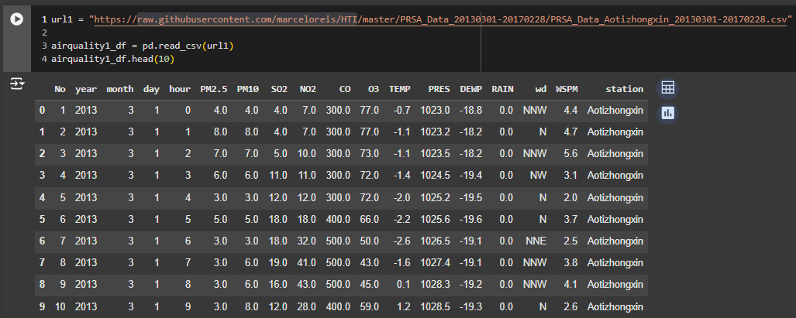

# Air Quality Dashboard ✨

# Proyek Analisis Data: Air Quality Dataset
- **Nama:** Ahmad Reinaldi Akbar
- **Email:** reinaldiakbar99@gmail.com
- **ID Dicoding:** ahmad_reinaldi_XV53

## About Dataset

### DATASET LINK
https://github.com/marceloreis/HTI/tree/master/PRSA_Data_20130301-20170228

### 1. Deskripsi Dataset
Dataset ini berisi data kualitas udara yang dikumpulkan dari beberapa stasiun pemantauan di wilayah tertentu. Data mencakup pengukuran polutan udara, kondisi meteorologi, serta informasi waktu dan lokasi pengambilan sampel.

### 2. Kolom-Kolom dalam Dataset
- **No**: Nomor urut data.
- **year, month, day, hour**: Tanggal dan waktu pengambilan data.
- **PM2.5**: Konsentrasi partikel udara berukuran ≤2.5 µm (mikrogram/m³).
- **PM10**: Konsentrasi partikel udara berukuran ≤10 µm (mikrogram/m³).
- **SO2**: Konsentrasi sulfur dioksida (µg/m³).
- **NO2**: Konsentrasi nitrogen dioksida (µg/m³).
- **CO**: Konsentrasi karbon monoksida (µg/m³).
- **O3**: Konsentrasi ozon (µg/m³).
- **TEMP**: Suhu udara dalam derajat Celcius (°C).
- **PRES**: Tekanan atmosfer dalam hPa.
- **DEWP**: Suhu titik embun dalam derajat Celcius (°C).
- **RAIN**: Curah hujan (mm).
- **wd**: Arah angin (misalnya, N, NNW, dll.).
- **WSPM**: Kecepatan angin dalam m/s.
- **station**: Nama stasiun pengamatan.

### 3. Tujuan Dataset
Dataset ini dapat digunakan untuk memahami dan menganalisis:
- Kualitas udara di suatu wilayah pada berbagai waktu.
- Hubungan antara kondisi meteorologi (suhu, kecepatan angin, curah hujan) dengan konsentrasi polutan udara.
- Polusi udara dan tren musiman yang mungkin ada.
- Efek polusi terhadap lingkungan dan kesehatan masyarakat.

### 4. Potensi Analisis yang Dapat Dilakukan
- **Analisis Korelasi**: Mengukur hubungan antara polutan (PM2.5, PM10, NO2, CO, dll.) dengan suhu dan kecepatan angin.
- **Perbandingan Kualitas Udara Antar Stasiun**: Menganalisis perbedaan konsentrasi polutan di berbagai stasiun pengamatan.
- **Analisis Tren Musiman dan Harian**: Meneliti pola musiman dan harian dalam konsentrasi polutan.
- **Pengaruh Arah dan Kecepatan Angin**: Menentukan bagaimana arah dan kecepatan angin memengaruhi distribusi polutan.
---

## Data Analysis Step by Step

### 1. Data Wrangling
#### a. Gathering Data
- Mengumpulkan data dari sumber yang tersedia, baik itu file CSV, database, atau API.
- Pastikan data mencakup variabel-variabel yang relevan untuk analisis.


#### b. Assessing Data
- Melakukan inspeksi awal untuk memahami struktur data, jenis data, dan cakupan waktu.
- Mengidentifikasi masalah seperti data duplikat, missing value, atau outlier.


#### c. Cleaning Data
- **Mengatasi Missing Value**:
  - Menghapus baris atau kolom yang memiliki banyak missing value.
  - Mengisi missing value dengan rata-rata, median, atau strategi lain yang sesuai.
- **Mengatasi Outlier**:
  - Menggunakan teknik seperti IQR (Interquartile Range) atau Z-score untuk mendeteksi dan menangani outlier.

---

### 2. Exploratory Data Analysis (EDA)
#### a. Exploring Data
- Menghitung statistik deskriptif seperti rata-rata, median, maksimum, dan minimum.
- Mengeksplorasi distribusi data dengan histogram, boxplot, atau scatter plot.
- Menganalisis hubungan antar-variabel menggunakan heatmap korelasi.

---

### 3. Visualisasi Data Berdasarkan Pertanyaan Bisnis
#### Contoh Pertanyaan Bisnis:
- **Bagaimana tren kualitas udara sepanjang waktu?**
  - Gunakan line plot untuk menunjukkan perubahan konsentrasi polutan (misalnya, PM2.5) dari waktu ke waktu.
- **Apakah ada hubungan antara suhu dan konsentrasi NO2?**
  - Gunakan scatter plot untuk memvisualisasikan hubungan antara suhu (TEMP) dan NO2.
- **Bagaimana distribusi polutan di setiap stasiun?**
  - Gunakan boxplot untuk membandingkan distribusi polutan di berbagai stasiun.

---

### 4. Analisis Lanjutan: Group Clustering Manual
#### a. Definisi Kelompok (Clustering Manual)
- Tentukan rentang nilai untuk setiap kelompok berdasarkan domain knowledge atau statistik deskriptif.
  - **Contoh**: 
    - Kelompok rendah: NO2 < 50 µg/m³
    - Kelompok sedang: 50 ≤ NO2 < 100 µg/m³
    - Kelompok tinggi: NO2 ≥ 100 µg/m³

#### b. Implementasi Clustering
- Tambahkan kolom baru yang berisi kategori kelompok berdasarkan nilai variabel.
- Hitung persentase data yang masuk ke dalam setiap kelompok.

#### c. Visualisasi Clustering
- Gunakan pie chart atau bar chart untuk menampilkan proporsi data dalam setiap kelompok.
- Gunakan heatmap untuk menampilkan distribusi nilai antar-kelompok.

---

## Setup Environment - Anaconda
```
conda create --name main-ds python=3.9
conda activate main-ds
pip install -r requirements.txt
```

## Setup Environment - Shell/Terminal
```
mkdir proyek_analisis_data
cd proyek_analisis_data
pipenv install
pipenv shell
pip install -r requirements.txt
```

## Run steamlit app
```
streamlit run dashboard.py
```